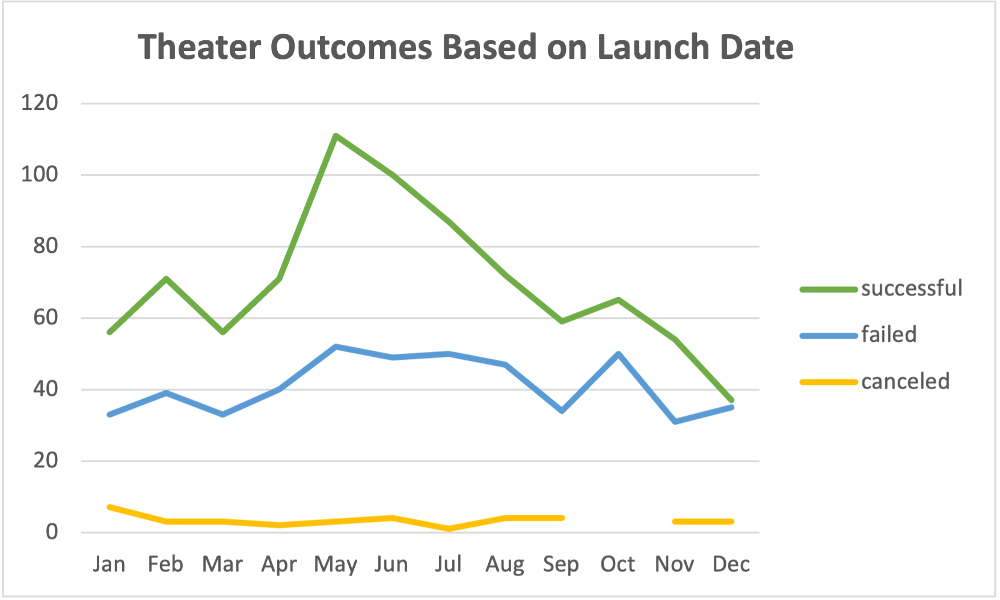
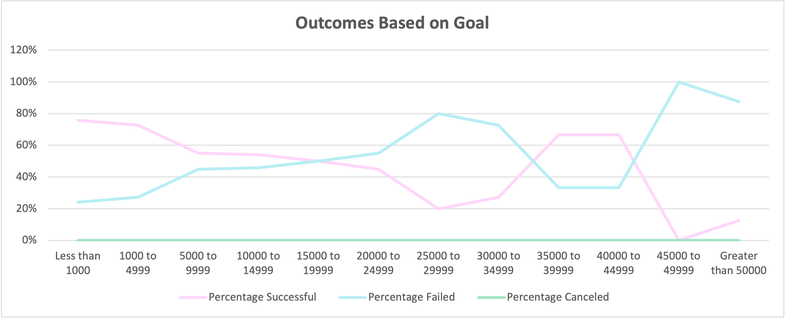

# Kickstarting with Excel

## Overview of Project
This project utilizes data from global Kickstarter campaigns to analyze trends related to if campaigns were successful or not.

### Purpose

The purpose of this project was to focus on the data from theater kickstarter campaigns.  Then to analyze if there were trends in the data telling if the campaign would be successful or not, related to the campaigns launch date and funding goal.

## Analysis and Challenges

### Analysis of Outcomes Based on Launch Date
To complete this analysis, first I looked at the success rate of the campaigns based on the month they were launched.  Using the data, I grouped the campaigns based on the month they were created.  I then created a pivot table to count the number of theater campaigns successful, failed, and canceled in each month.  The graph below shows the number of either successful, canceled, or failed theater campaigns by month for the years 2009 to 2017.

### Analysis of Outcomes Based on Goals
The second way I analyzed the data was to compare the campaigns fundraising goal against if the campaign was successful, failed, or canceled. For this analysis I used the data from theater play campaigns from the years 2009 to 2017.  To complete this analysis, I first grouped the campaigns based on their fundraising goals, starting at below $1,000 and then increased the groupings in increments of $5,000 up to over $50,000.  I then created a chart to count the number of successful, canceled, and failed campagins in each fundraisng grouping.  Then from that calcuated the percentage of successful, canceled, and failed campaigns in each fundraising group.  I created the graph below from my findings which shows the percentage of either successful, failed, or canceled campaigns based on its fundraising $ goal.

### Challenges and Difficulties Encountered
I am very comfortable using MS Excel in my daily life, so I did not encounter too many challenges while analyzing this data.  There are some challenges related to this data set that one may run into while trying to analyze.  One of these challenges, is that the dates for each campaign are listed in Unix Timestamps.  If someone is unfamiliar with what these are, they may be unable to convert them to readable dates. This would limit their ability to break the analysis down by year or month.  To be able to convery Unix Timestamps to readable dates, one could simply google "unix timestamp converter."  However, you would have to manually copy and paste each date into the online converter, which would take quite a long time.  The easiet way would be to create a formula in MS Excel to convert the date for you.  A Unix timestamp is the numer of seconds since January 1, 1970.  To convert to a readable date in excel, create a new column, then 1st divide the timestamp by 60 (for 60 seconds in a minute).  Then divide that again by 60 (for 60 minutes in an hour).  Then dvide that by 24 (for 24 hours in a day).  Take that number and use "+DATE" in excel to let excel we want our result in a date format.  Then add (1970,1,1).  This lets excel know that we want to add the number of days we calculated to 1970, the first month, and the first day (Jan 1st).  Your final formula should look like =(((*cell with timestamp*/60)/60)/24)+DATE(1970,1,1)

## Results
### What are two conclusions you can draw about the Outcomes based on Launch Date?
- The first conclusion I can draw from the Outcomes Based on Launch Date is that May followed by June had the largest number of successful campaigns.  May had 111 successful campaigns and June had 100.  One could argue that this is simply just because those months also had the largest total number of launced campaigns (May 166 and June 153 total campaigns).  However, May and June also had the largest percentages of campaigns launced in those months compared to the other months.  67% of the campaigns launched in May and 65% of the campaigns launched in June were successful.  The average perentage of successful campaigns across all months was 61%.  One could conclude from this data that if you launch your campaign in May, you would have the best odds of your campaign being successful.
 - The second conclusion I can draw is that December would be the worst month to launch a campaign because it had the highest rate of failed campaigns.  47% of campaigns launched in Decemeber failed.  Also, 4% of campaigns launched in Decemeber were canceled.  This means that more than half of the campaigns in December (51%) were either failed or canceled. (If you combine the number of failed and canceled campaigns the average percentage for each month is 39%).  Only 49% of campaigns in Decemeber were successful, which is the lowest rate of all the months as shown by the graph above.  This is also below the average of 61% mentioned above. 
 

### What can you conclude about the Outcomes based on Goals?
- I can conclude that campaigns with goals of less than $5,000 had the higest success rate.  These campaigns achieved a success rate of 73% to 76%.  Campaigns that had fundraising goals of $45,000 or more only had a 13% or lower successful rate.

### What are some limitations of this dataset?
- There are a few limitations from this dataset.  One would be that the data could be considered somewhat outdated, as the data ends in 2017.  I would be curious to see the dataset expanded through 2021, to see how macro environmental factors such as the gloabl pandenmic starting in 2020 affected the outcomes of this data. This is because for this analysis we are focusing on theater and plays, which are social gatherings.  In addition, loss of jobs or income for people in 2020 could affect the number of backers or the amount of their donations.

### What are some other possible tables and/or graphs that we could create?
- There are also some additional graphs or charts that I would include to be able to analyze this data further.  Currently this is worldwide data.  I would break down the outcomes based on goals by country because not all currency is the same in each country.  This chart is not necessairly comparing apples to apples because $100,000 USD is not necessairly the same as 100,000 SEK.  As seen in the data in the chart above there were 13% of campaigns with goals greater than 50,000 that were successful.  If you are looking at this chart in the mindset of USD then this information could be misleading. One of these successful campaigns had a goal of 100,000 SEK. For comparison 100,000 SEK is equal to about $11,600 USD.
- I would also want to add a chart that looks at the number of backers for each successful campaign and average contribution amount.  I would be curious to see the number of successful campaigns where just one very involved backer contributed the majority of the goal amount. 

